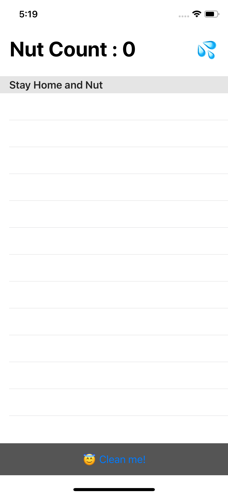
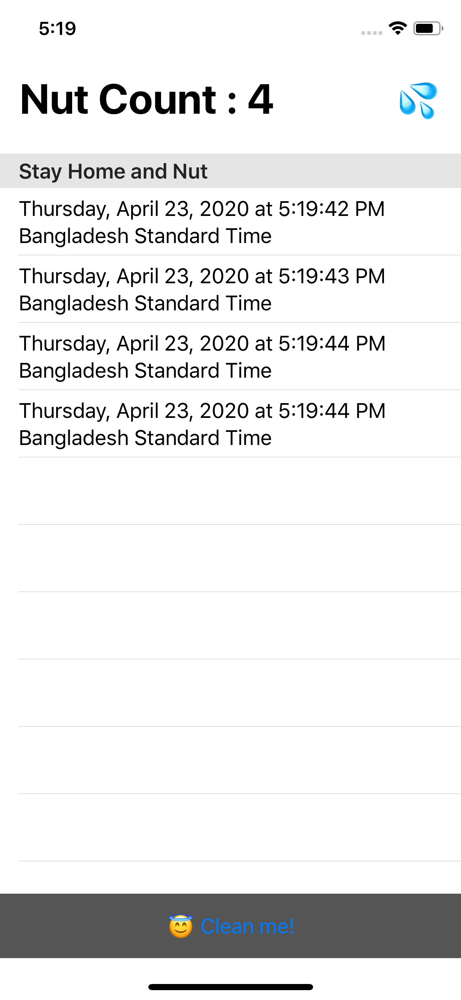
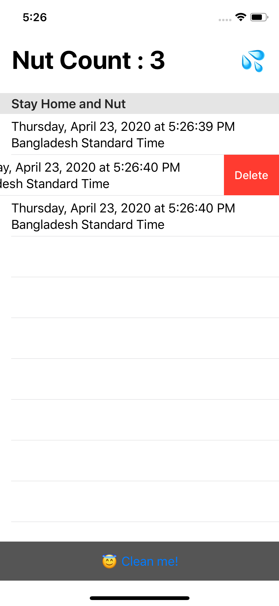
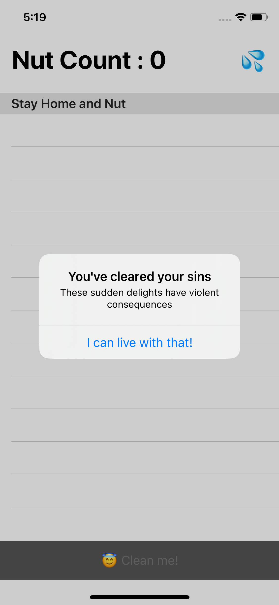

# Nutter
> Stay home and count how many times you nutted

## Data and Privacy
Your data is your data and nobody elses data. All the records persist as core data on your device and you can clear them whenever you want. Certainly you don't want the world to know about your nut habits!

## Device Support
iPhone, iPad with iOS 13 or later.

## Running the app
Clone the repo, open the project in Xcode, sideload on your device or run in a Simulator.

## Screenshots

<table>
  <tr>
    <td>
      <b>Main Window</b>
      
    </td>
    <td>
      <b>Just tap the 💦button to add a nut</b>
      
    </td>
  </tr>

  <tr>
    <td>
      <b>Delete individual nuts</b>
      
    </td>
    <td>
      <b>Come clean (Clear them all!)</b>
      
    </td>
  </tr>
</table>

## License
MIT
